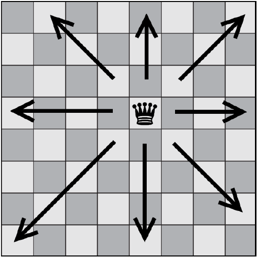

# The 8 Queens Puzzle

In the game of chess, the queen can attack across any number of unoccupied squares on the board horizontally, vertically,
or diagonally. 

  

The 8 Queens Puzzle involves putting 8 queens on a standard chessboard such that none are under attack.

The script "genetic.py" contains the genetic algorithm engine which is then used in the script "8queensTest.py" to resolve the problem and shows as final output a board of 8 queens 
for which none of them are being attacked. 

Modules used: datetime, unittest, random, statistics, sys, time
